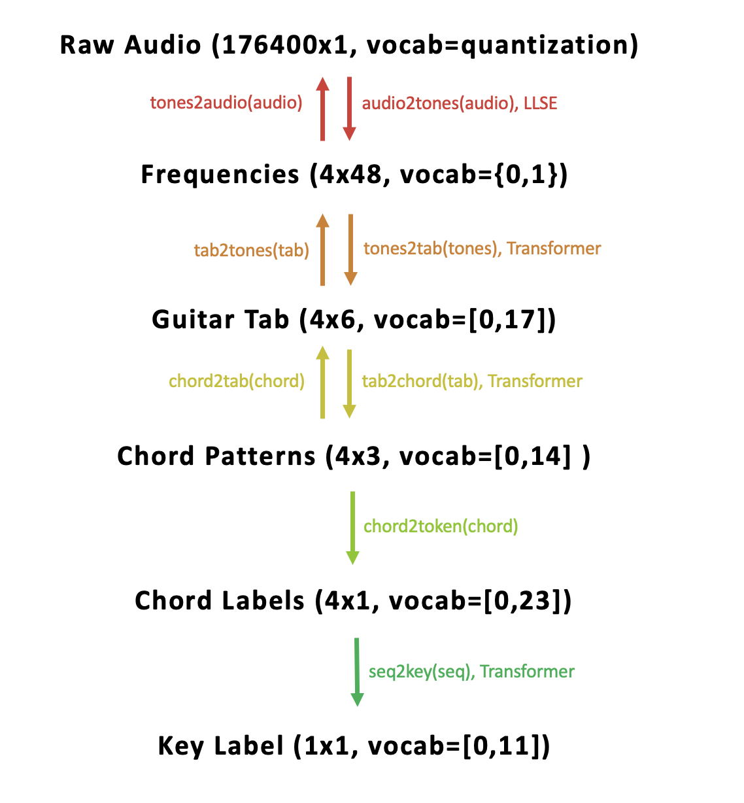

# Teaching AI to recognize chord progressions based on their geometric representation on a guitar fretboard

## Overview

In this project, I utilize the encoder-only transformer architecture to define mappings between the six different vector spaces I find relevant for representing music on the guitar. For a given chord progression played on the guitar and recorded, these spaces refer to its representation (1) in time, (2) as a progression of combinations of pure-frequency waves, (3) as guitar tablature, (4) as the development of a fretboard pattern, (5) as a progression of chord labels, and (6) as a single label for the key of the piece. Notice that these representations are ordered based on how much information they reveal about the original recording. The results of this project consist of several functions of the form _x2y(music)_, which allow users to convert a chord progression from its _x_ representation to its _y_ representation. The diagram below depicts which mappings I have quantified.

## Intro

Why did I do this? The representation in time (as a wav file) stores the most amount of information about a given recording; if I play the recording out of a speaker, I will instantly hear differences in the chords, the instrument that was used, the noise from the recording environment, the emotion of the musician, any audio effects applied, et cetera. However, even though the signal is created in time, our brains actually interpret the sound as extremely intricate combinations of pure waves at different frequencies. Does this mean that sound is better understood by its frequency content rather than by its amplitude in time? After all, it seems that the neural networks in our brains prefer analyzing sound based on frequency. I would say that nature itself is more fundamentally represented in this way, so in order to learn from everything going on around us with limited processing power, the brain naturally ended up focusing its resources on the fundamental qualities of sound. When we learn music, it follows that we begin by trying to understand the most fundamental relationships between different frequencies and gradually learning more complicated relationships. Our behavior is extremely replicative of the way our brain's neural network is designed. In this project, I reflect on the way that we have decided to build and teach the guitar; I propose an efficient AI model that learns music by understanding the fundamental relationships between the patterns on the guitar fretboard.

Most music analysis algorithms utilize frequency content to classify or generate music. This makes sense---music can be compactly described as interesting combinations of frequencies. After all, music elements such as pitch, tone, harmony, timbre, melody, rhythm, and tempo are all typically characterized by their frequency content. However, at the start of this project this seemed very unintuitive to me at a fundamental level. When people learn how to play the guitar, or any intrument for that matter, they almost never bother to learn the frequencies of notes. Learning music is often geometric; we say that "this" finger pattern sounds especially good next to "that" finger pattern. I think that what we have done is simplify our understanding of sound one more time: instead of representing the recording of a chord by a long vector of numbers revealing its frequency content across the entire range of human hearing, we use a short vector of just a few numbers to capture only the most fundamental information about the signal. On the guitar, this is a vector of 6 numbers, where each number corresponds to the fret held on each of the 6 strings of the guitar. In fact, we prefer to learn songs by reading guitar tablature, as in guitar_tab_example.png. We like representing music in this way because there are less relationships to keep track of and the patterns are more obvious to see. On the piano, this is a vector of 88 numbers, where each number can only be 1 or 0 (there are 88 keys on a piano and at a given moment each one is either pressed or not pressed). I argue that teaching AI piano and teaching AI guitar are two very different tasks, and should be regarded as such. Moreover, I argue that if the task of creating music is simplified by creating instruments, then music AI models should also try to build off of these simpler data structures. In this project, I found that encoder-only Transformer architectures are useful for classifying and converting between different representations of a chord progression. Moreover, I found that the model could understand how specific shapes related to others, and even got the model to generate tablature from an audio file.

## Explanation of the Three Transformers

## Audio to frequency

We can recreate this level of understanding mathematically using the Fourier Transform. The Fourier Transform multiplies a given signal in time by a hypothetical pure-frequency wave and outputs the resulting number. If the number is large, it means the signal is very similar to the hypothetical wave. It performs this calculation by (1) measuring the amplitudes of the signal and the wave at a given point in time, (2) multiplying these two amplitudes together, (3) doing this for every measurement taken, (4) adding the results to get one number, and (5) dividing by the number of measurements to normalize the result. This process is called taking an inner product of two signals. It follows that taking the Fourier Transform of the signal across a range of frequencies reveals the frequency content of the signal in that range. Moreover, it's clear that using the maximum number of measurements in Fourier calculation gives the most accurate picture of the frequency content of the signal. In audio processing, we typically record music at a rate of 44100 measurements per second. This is because the human ear ignores frequencies above about 22000 Hz, so it would be a waste to record any faster than that. * Note: in order to measure a wave fast enough to capture its true frequency, you need to sample twice as fast as the wave itself. Otherwise, it would seem as though you were measuring an extremely slow wave, like how car tires on the freeway sometimes look like they start slowly turning backward. A sampling rate of 44100 samples per second ensures that we recognize any wave within the frequency range of human hearing. *  In this project, instead of capturing as much information about the recording as possible, I use the Linear Least Squares Estimation model to only calculate the Fourier Transform for the frequencies created by the 49 possible notes on the guitar (assuming standard tuning). Moreover, I only calculate transform for one second at a time (The H matrix in the LLSE model has dimension 49 by 44100. Once I calculate the matrix used in the solution to the LLSE model once, I do not need to do it again. In other words, the FT calculation is incredibly fast, as I only need to do one matrix multiplication). This allows me to capture how the frequency content changes from one chord to the next. By looking at the largest Fourier outputs, I can instantly predict which notes were used at each one-second interval in the audio file.

I am currently working on a code that will detect when a new chord is played and efficiently only takes samples in the one second interval after this onset.

## Chord Representation

On the piano, musical scales are visually obvious because note frequencies gradually increase from left to right, where every 12th step doubles the frequency of the note (in music, two notes with 2:1 frequency ratio sound so pure together that we call them the same note. Because of this, for nomenclature we defined a 12 note C-C#-D-D#-E-F-F#-G-G#-A-A#-B-C pattern and repeated it continuously as frqeuencies exponentially increase. We use 12 steps because this coincidentally allows the 7th step to align with the frequency exactly halfway along the scale, the 5th step to align with the frequency exactly a third of the way along the scale, the 3rd step a quarter of the way, etc. The sharps exist because only 8 steps align with nice ratios---these are C-D-E-F-G-A-B-C. These are the common tones in music. When we change key, we change the starting note of the scale. There are 12 keys, but we often speak only in terms of the 8 main tones. Hence the term 'octave.' Chords consist of three notes in a given key with nice ratios). On the guitar, the unique tuning pattern of the strings allows for several different finger patterns to represent the same chord. This can be seen in the provided image 'fretboard_key_of_c.png.' For example, notice that the chord C-E-G can be played in many different ways. Since I want my model to learn these different representations, to create my dataset I first defined the 6 common ways to represent each of the 7 common chords in each of the 24 common keys of music (12 major and 12 minor. I should note here that the minor scale is the same as the major scale started on the 6th tone. I define them differently in my dataset because chord progressions are defined as major or minor). Then, I defined 39 of the most common chord progressions in the major scale and 43 of the most common chord progressions in the minor scale. For each of these progressions in a given key, I randomly created 150 different ways to play that progression on the guitar by randomly selecting different voicings for each chord. I used 150 because this would allow my dataset to be of length 147,600 (150 voicings * (39+43) progressions * 12 keys). I liked this number because it is analogous to the size of the CIFAR dataset where there are 6,000 instances of each class (6,000 * 24 possible keys = 144,000).

There are five main chord shapes on the guitar: C, A, G, E, and D. Each of these shapes can be made major or minor by changing one fret. Moreover, each of these shapes can be shifted to any fret on the guitar to represent the same chord in a different key. For now, I am only concerning myself with progressions that contain only major or minor chords. Therefore, I am able to define a counting system of 5*2*12 = 120 tokens that contain all common ways of playing any major of minor chord on the fretboard. In the project, I also include a sixth shape for chord representations beyond halfway down the guitar string. This brings the vocabulary length of the tokens to 150, and helps the model understand that chord shapes repeat after fret 12.

## The Model

The internal dimension of each model is 512 and each encoder layer loops 6 times. I used sparse categorical cross entropy loss, as my outputs are always tokens. The self attention uses 8 heads and the dimension of every hidden feed-forward layer is 2048.

## Comments

Moving forward, I would like to add chord shapes with 7ths, 6ths, 9ths, sus, and more. This would simply require more training and a few more manually-defined chord progressions. Moreover, I would like to add a decoder that can generate tokenized melodies from the chord progression recieved by the encoder. However, to do this I would want the model to be able to understand timing and (possibly) instrumentation. I would therefore need to implement the compound word transformer, which I attempt in the next draft of this project.

I can also build a decoder alongside each encoder to make a generative model. I think this way of thinking could be applied to the piano. I also think adding a decoder could allow the model to be applied to things like computer strategy.

## References

Link to 'fretboard_key_of_c.png' screenshot source: https://upload.wikimedia.org/wikipedia/commons/1/1b/C_Major_Scale_on_fretboard.svg
Link to 'guitar_tab_example.png' screenshot source: https://s3.amazonaws.com/halleonard-pagepreviews/HL_DDS_0000000000093646.png

I took inspiration from the following papers:
- Compound Word Transformer: Learning to Compose Full-Song Music over Dynamic Directed Hypergraphs. (2021).
- Defossez et al. Music Source Separation in the Waveform Domain. (2021).
- Dosovitski et al. An Image is Worth 16x16 Words: Transformers Image Recognition at Scale. (2021).
- Liu et al. Swin Transformer: Hierarchical Vision Transformer using Shifted Windows. (2021).
- Huang et al. Shuffle Transformer: Rethinking Spatial Shuffle for Vision Transformer. (2021).
- Parmar et al. Image Transformer. (2018).
- Shaw et al. Self-Attention with Relative Position Representations. (2018).
- Vaswani et al. Attention Is All You Need. (2017).
- Dong et al. MuseGAN: Multi-track Sequential Generative Adversarial Networks for Symbolic Music Generation and Accompaniment. (2017).
